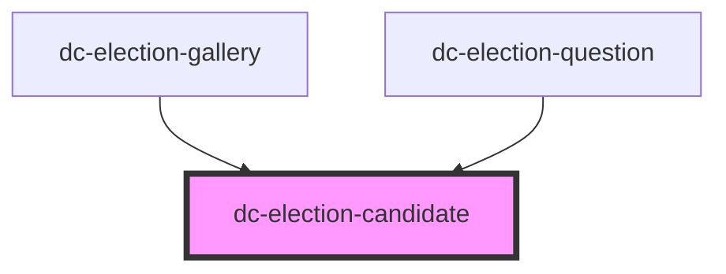

# dc-election-candidate

<!-- Auto Generated Below -->

## Properties

| Property   | Attribute  | Description | Type     | Default |
| ---------- | ---------- | ----------- | -------- | ------- |
| `bio`      | `bio`      |             | `string` | `null`  |
| `fullname` | `fullname` |             | `string` | `null`  |
| `office`   | `office`   |             | `string` | `null`  |
| `photo`    | `photo`    |             | `string` | `null`  |

## Dependencies

### Used by

 - [dc-election-gallery](../dc-election-gallery)
 - [dc-election-question](../dc-election-question)

### Graph

----------------------------------------------

*Built with [StencilJS](https://stenciljs.com/)*
