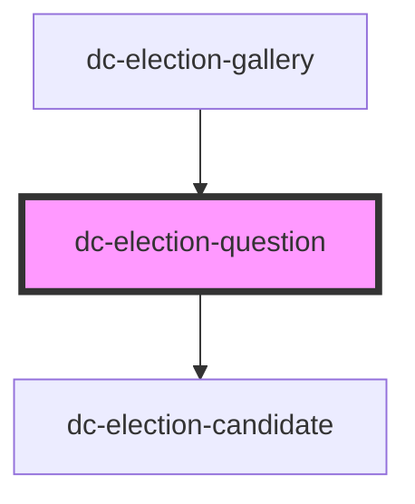

# dc-election-question

<!-- Auto Generated Below -->

## Properties

| Property   | Attribute  | Description                                                                                                                                    | Type     | Default |
| ---------- | ---------- | ---------------------------------------------------------------------------------------------------------------------------------------------- | -------- | ------- |
| `groups`   | --         | Holds an Array of answers to candidates [    {response: "Yes", "candidates": ["C1", "C2"]},    {response: "No", "candidates": ["C3", "C4"]}  ] | `any[]`  | `[]`    |
| `question` | `question` |                                                                                                                                                | `string` | `null`  |

## Dependencies

### Used by

 - [dc-election-gallery](../dc-election-gallery)

### Depends on

- [dc-election-candidate](../dc-election-candidate)

### Graph

----------------------------------------------

*Built with [StencilJS](https://stenciljs.com/)*
